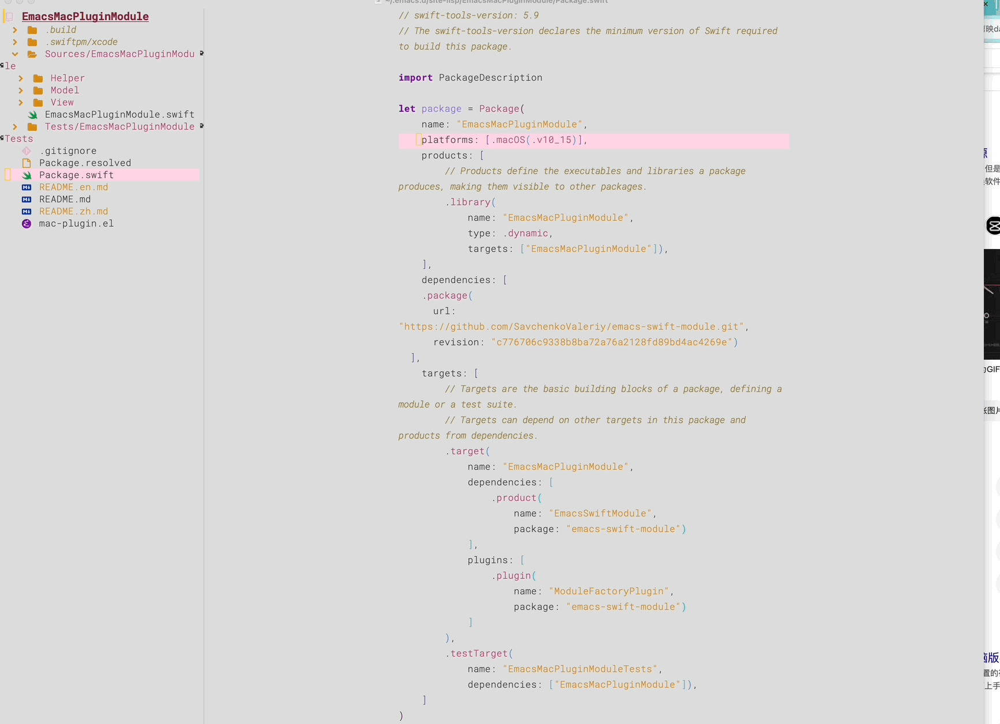

# EmacsMacPluginModule

[English README](README.en.md) | [中文 README](README.zh.md)

`EmacsMacPluginModule` is a macOS plugin for Emacs that implements dynamic cursor effects and more, exclusively for macOS. This plugin leverages `module-load` to load a `.dylib` written in Swift, facilitating interaction between Emacs and Swift. It uses the implementation approach from [SavchenkoValeriy/emacs-swift-module](https://github.com/SavchenkoValeriy/emacs-swift-module) and draws on [xenodium/EmacsMacOSModule](https://github.com/xenodium/EmacsMacOSModule) for applying these techniques. The cursor animation effects are inspired by the [manateelazycat/holo-layer](https://github.com/manateelazycat/holo-layer.git) project.




## Installation

### Prerequisites

- Emacs
- Swift and Swift Package Manager
- macOS

### Steps

1. Clone the repository to your Emacs `site-lisp` directory:

   ```sh
   git clone https://github.com/happyo/EmacsMacPluginModule.git ~/.emacs.d/site-lisp/EmacsMacPluginModule
   ```

2. Add the following code to your Emacs configuration file (`~/.emacs.d/init.el` or `~/.emacs`):

   ```elisp
   (add-to-list 'load-path "~/.emacs.d/site-lisp/EmacsMacPluginModule")

   (require 'mac-plugin)

   ;; Need disable tool-bar
   ;;(when (fboundp 'tool-bar-mode)
   ;;  (tool-bar-mode -1))
   ;; If the downloaded repository directory is different from the above, you can specify the actual directory of the repository with macos-project-root
   (mac-plugin-load-release)
   (atmosphere-enable)
   (mac-plugin-set-cursor-color "#fcc800")
   (mac-plugin-set-shadow-opacity 1.0)
   ```

3. Manually invoke M-x in Emacs and execute the command to build the dylib, which only needs to be done once:

   ```elisp
   (macos-module-build-release)
   ```

   Alternatively, you can manually execute the following command after navigating to the repository directory:

   ```sh
   swift build -c release
   ```

## Usage

### Load the Module

Load the module in Emacs:

```elisp
(mac-plugin-load-release)
```

### Enable Cursor Animation

Enable cursor animation effects:

```elisp
(atmosphere-enable)
```

### Set Cursor Color

Set the cursor color (e.g., set to `#fcc800`):

```elisp
(mac-plugin-set-cursor-color "#fcc800")
```

### Set Shadow Opacity

Set the shadow opacity (e.g., set to `1`):

```elisp
(mac-plugin-set-shadow-opacity 1)
```

## Contributing

We welcome issues and requests, as well as pull requests to contribute your code!

## References

- [SavchenkoValeriy/emacs-swift-module](https://github.com/SavchenkoValeriy/emacs-swift-module)
- [xenodium/EmacsMacOSModule](https://github.com/xenodium/EmacsMacOSModule)
- [manateelazycat/holo-layer](https://github.com/manateelazycat/holo-layer.git)

## License

This project is licensed under the GPL License. See the LICENSE file for details.

## Future Plans

We plan to add more macOS plugins to further enhance Emacs functionality. If you have any suggestions or features you would like to see, please let us know.

